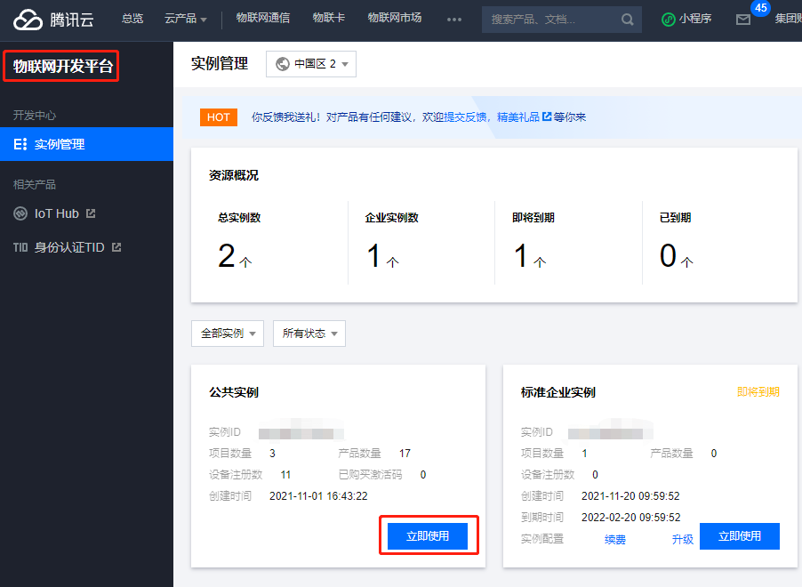
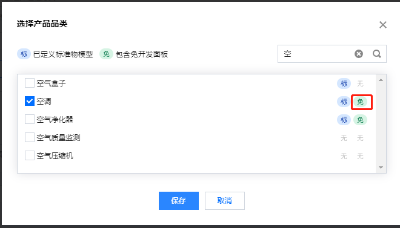
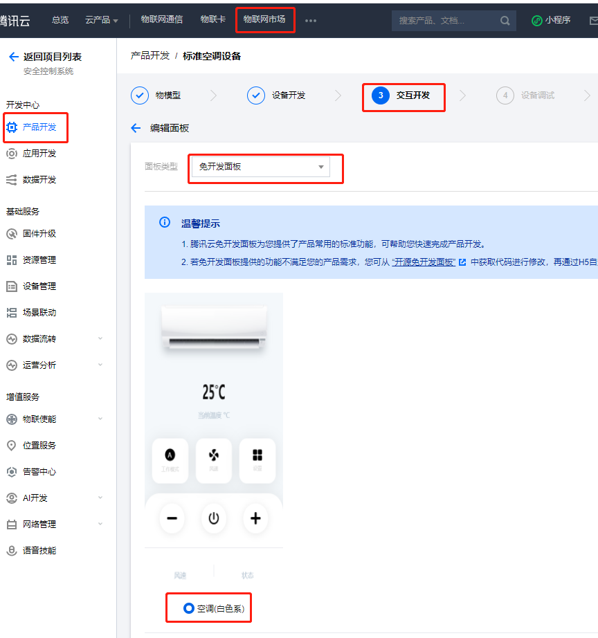
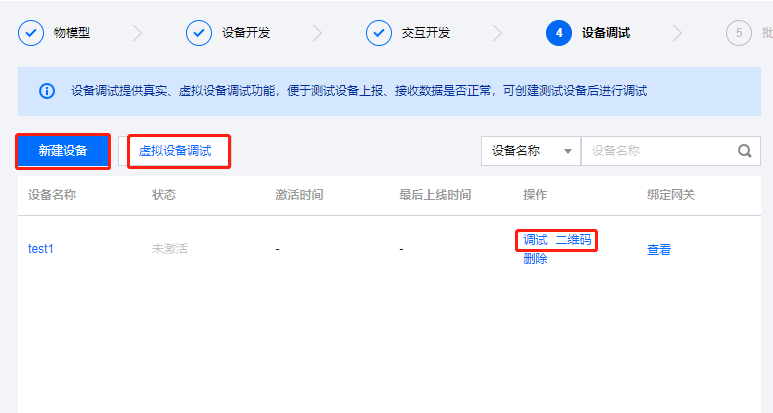

# 腾讯云物联网开发平台

[腾讯云物联网开发平台](https://cloud.tencent.com/product/iotexplorer)是面向智慧生活与产业互联应用的物联网 PaaS 平台，为基于物联网的各行业设备制造商、方案商 及应用开发商提供一站式设备智能化服务。平台提供海量设备连接与管理能力及基于腾讯连连的小程序应用开发能力，并打通腾讯云云产品及 AI 能力，聚合腾讯生态内容能力。从而提升传统行业设备智能化的效率，降低用户的开发运维成本。

## 免开发面板配置

配置过程分为三步

### 1、在腾讯云开发平台创建【项目】和 【产品】

如图所示有免字的即可选择免开发面板

### 2、选择产品后，在【交互开发】的【面板配置】里选择【免开发面板】

### 3、调试验证

